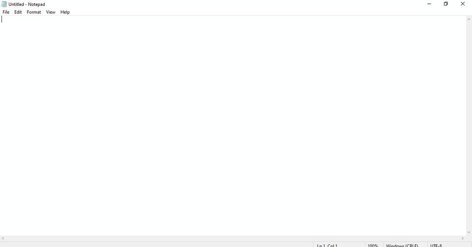
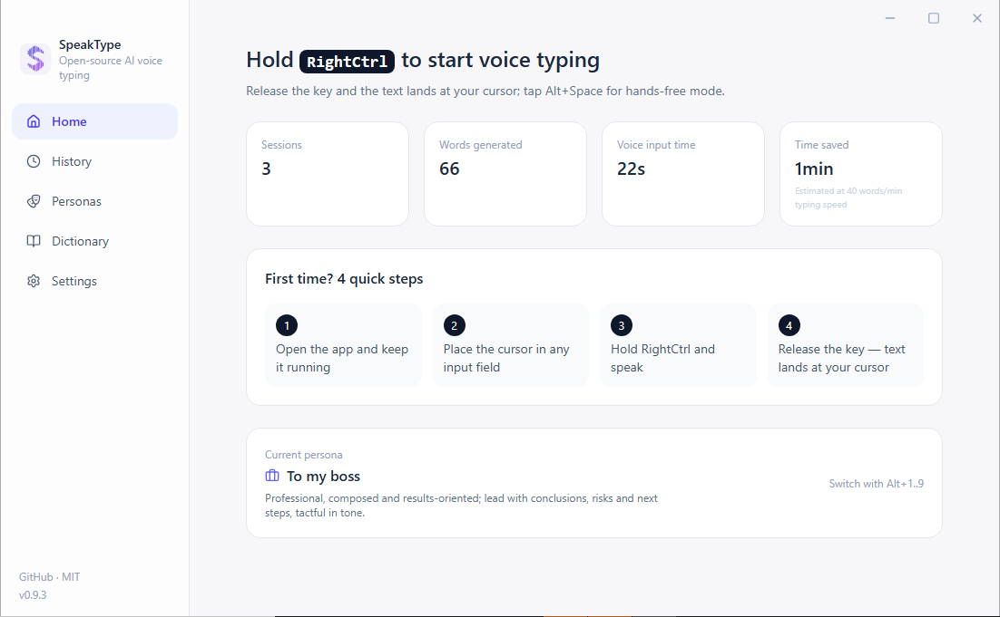
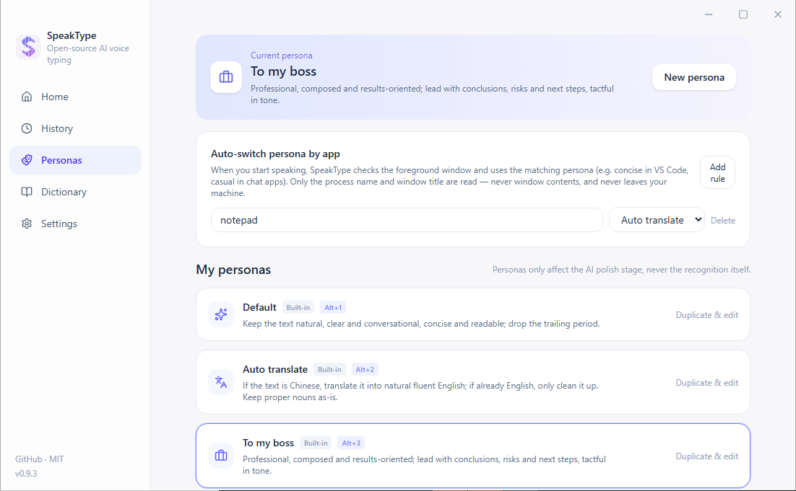
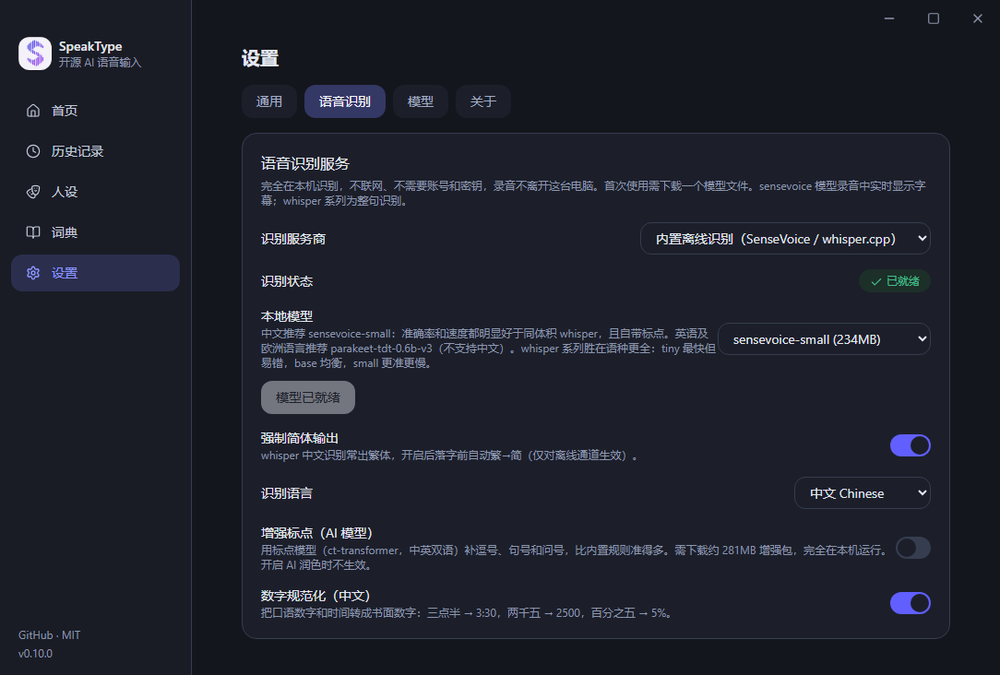
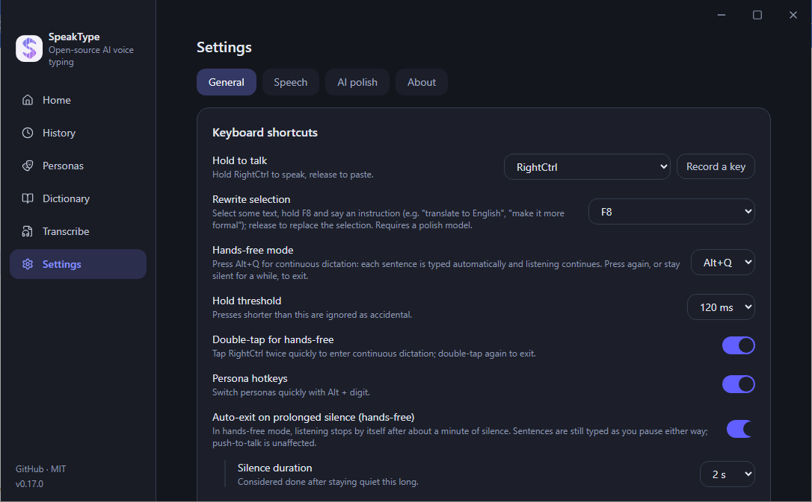

<div align="center">


# SpeakType

**你说，它写 —— 开源 AI 语音输入法，落字到任何程序。**

按住一个键说话，松手，文字就出现在光标处。<br/>
识别引擎、AI 润色、热词纠错全部由你定义，密钥与语音永不离开你的掌控。

[](LICENSE)
[](#-下载安装)
[](https://github.com/wookat/speaktype/releases/latest)
[](#-国际化)
[](CONTRIBUTING.md)

[⬇ 下载安装包](#-下载安装) · [🌐 官网](https://speaktype.zalize.com) · [English](README.md) · [报告问题](https://github.com/wookat/speaktype/issues) · [开发文档](desktop/README.md)





</div>

---

## ✨ 为什么是 SpeakType

市面上的 AI 语音输入法要么闭源、要么把你的语音送进厂商自己的服务器。SpeakType 反过来：

|  |  |
|---|---|
| 🔓 **完全开源（MIT）** | 协议、纠错算法、界面，每一行都能看、能改、能自部署 |
| 🛡️ **没有自己的后端** | 不架设任何云端服务，语音只发给**你自己选择并配置**的识别服务——或者干脆完全离线 |
| 🧩 **一切可插拔** | 识别引擎、AI 润色模型、热词词典、人设风格、快捷键，全部由你定义 |

## 🎬 核心体验

|  |  |
|---|---|
| 🎙️ **按住说话** | 按住 `RightCtrl`（可改）说话，实时字幕逐字上屏，松手自动落字到任何 Windows 程序的光标处 |
| ⚡ **免按模式** | `Alt+Q` 按一下开始、说完自动结束（静音检测），适合长段输入 |
| 🎭 **人设风格** | `Alt+1..9` 秒切：默认 / 自动翻译 / 汇报老板 / 命令行 / 自定义 prompt，还可按前台应用自动切 |
| 📈 **越用越准** | 落字后你手改对的词自动学进词典，同样的错不会再犯第二次 |
| ✍️ **选中即改写** | 选一段文字按住 `F8` 说「翻译成英文」「改得正式一点」，直接替换选区 |
| 📱 **手机当麦克风** | 台式机没麦克风？手机扫码即用，同一 Wi-Fi 走局域网直连，异地走可自部署的中转 |
| 📖 **热词纠错** | 词典里加上人名、产品名，同音/近音误字自动替换；历史页手动纠错还会**一键学进词典** |
| 🧠 **增强人声检测** | 可选下载 Silero VAD 神经网络（约 35MB，本机运行），噪声环境下自动结束与防幻听更准 |
| 🔁 **失败可重试** | 识别失败的录音保留在本机（最多 20 段/7 天/50MB，可关），历史页一键重试，不用重说 |
| 🌗 **暗色模式** | 实时跟随 Windows 深浅色设置，也可在设置中固定浅色/深色 |
| 🎵 **文件转录** | 拖入音频/视频文件（mp3、wav、m4a、mp4…最长 3 小时）→ 离线分段转写带时间戳 → 导出 TXT / SRT |

<div align="center">

</div>

## 🎛️ 识别引擎（三选一，随时切换）

<div align="center">

</div>

1. **内置离线识别**（默认推荐）：应用内一键下载模型——中文推荐 SenseVoice-Small（实测每句 0.27 秒、自带标点，兼顾英/日/韩/粤），英文及 25 种欧洲语言推荐 NVIDIA Parakeet TDT 0.6B v3（准确率更高），也可选 whisper.cpp（tiny/base/small）；完全本机识别，不联网、不注册、零密钥。
2. **任意 OpenAI 兼容转写接口**：填 Base URL + API Key + 模型名即可，内置 OpenAI Whisper / Groq（有免费额度）/ Fireworks / Mistral Voxtral / SiliconFlow / 阿里云百炼 预设，带测试连接。
3. **免 API Key 的网页通道**：ChatGPT 网页转写（免费账号也能用）或豆包语音，都是在应用内登录一次后复用你自己的会话。两条走的都是非公开接口，默认关闭，可能失效或与对方条款冲突，账号风险请自行判断，详见 [DISCLAIMER.md](DISCLAIMER.md)。

AI 润色同样接任意 OpenAI 兼容 Chat 端点（OpenAI / Google Gemini 的 OpenAI 兼容端点 / Groq / DeepSeek / 智谱 GLM-4-Flash / Kimi / 通义 / 本地 Ollama、LM Studio——本地端点 API Key 可留空），不配置则只做本地口语清理（如「5 点，不对，6 点」→「6 点」），不影响识别。

## 📦 下载安装

| 平台 | 下载 | 状态 |
|---|---|---|
| Windows 10/11 x64 | [SpeakType-Setup-0.17.0.exe](https://github.com/wookat/speaktype/releases/download/v0.17.0/SpeakType-Setup-0.17.0.exe)（~98MB） | ✅ 稳定 |
| Windows 绿色免安装 | [SpeakType-0.17.0-portable.exe](https://github.com/wookat/speaktype/releases/download/v0.17.0/SpeakType-0.17.0-portable.exe)（~87MB） | ✅ 稳定 |
| Android（手机当麦克风） | [SpeakType-0.17.0.apk](https://github.com/wookat/speaktype/releases/download/v0.17.0/SpeakType-0.17.0.apk) | ✅ 可用 |
| macOS（Apple Silicon / Intel） | 适配层已合并，安装包待 macOS 环境构建 | 🚧 开发中 |

最新发布：https://github.com/wookat/speaktype/releases/latest · 官网：https://speaktype.zalize.com

也可以用 [Scoop](https://scoop.sh) 安装：

```powershell
scoop bucket add speaktype https://github.com/wookat/scoop-speaktype
scoop install speaktype
```

1. 安装（SmartScreen 拦截时点「更多信息 → 仍要运行」，安装包未做商业签名）。
2. 设置 → 语音识别 → **内置离线** → 下载模型（或填你自己的 API Key）。
3. 把光标放进任何输入框，按住 `RightCtrl` 说话，松手落字。

## 🔒 隐私边界

- SpeakType **没有服务器**，不收集、不上传任何语音、文本、统计。
- 语音只发给你配置的识别服务；离线模式下不出本机。
- 「学你手改的词」的文本比对全部在本机完成。
- API Key、历史记录、失败录音全部只存本机（`%APPDATA%\SpeakType`）。
- 仓库不内置任何第三方凭证。

## 🌏 国际化

界面内置简体中文、繁體中文、English、日本語、한국어（跟随系统或手动切换，即时生效）；语言包架构支持社区继续添加更多语言。

<div align="center">

</div>

## 🛠️ 参与开发

```bash
cd desktop
npm install
npm run dev        # 开发模式
npm run typecheck
npm run pack       # NSIS 安装包 → release/
```

技术栈：Electron + React 19 + Tailwind 4 + lucide-react；全局热键 uiohook-napi；落字 koffi SendInput；离线识别 SenseVoice / Parakeet（sherpa-onnx）/ whisper.cpp；增强 VAD Silero + onnxruntime；手机麦克风走可自部署的 Cloudflare Worker 中转。详见 [desktop/README.md](desktop/README.md)。

仓库里还有一个更早形态的 [Chrome 浏览器扩展](docs/browser-extension.md)（网页内按住说话落字）。

欢迎 [Issue](https://github.com/wookat/speaktype/issues) 与 Pull Request。贡献流程见 [CONTRIBUTING.md](CONTRIBUTING.md)。

## 📄 许可

[MIT](LICENSE) © wookat & SpeakType contributors

> SpeakType 是独立的开源项目，与 OpenAI、Google、字节跳动、智谱等公司无关。免 API Key 的通道复用用户自己在本机的登录态访问对方网页端的非公开接口，可能不符合其服务条款，账号风险由使用者自行判断；不介意可用，介意请改用内置离线识别或自带 API Key 的服务。完整说明见 [DISCLAIMER.md](DISCLAIMER.md)。
